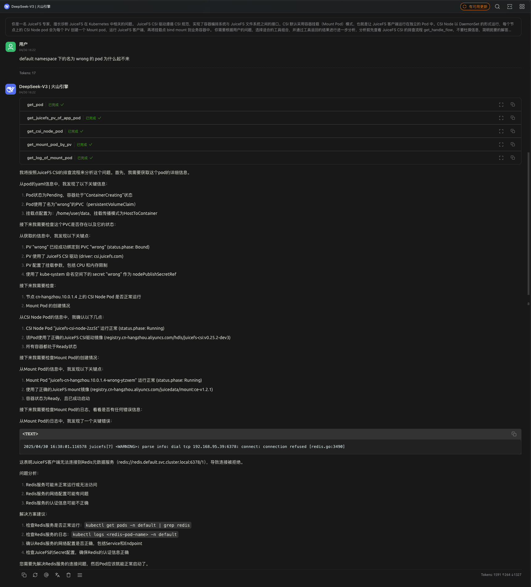

# juicefs-mcp-server

## Start

### in Kubernetes

todo

### dev

Build JuiceFS MCP server locally:

```shell
make build
```

Start JuiceFS MCP server locally:

```shell
bin/juicefs-mcp-server --deug
```

## Run

### with CSI MCP



### with JuiceFS MCP


